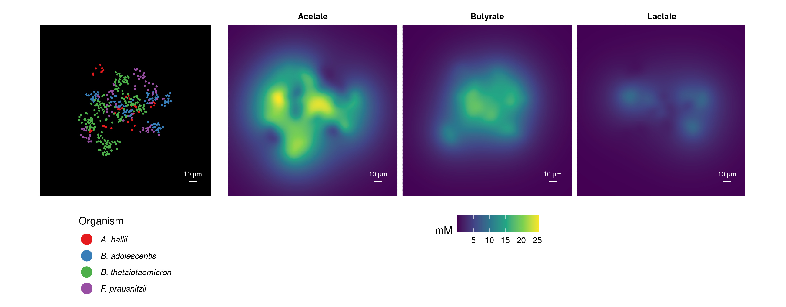

**The Nutriinformatics Research Group uses metabolic modelling approaches to gain a deeper understanding of how microbial metabolism contributes to the human metabolome in health and disease.**

### Research areas
- Metabolic modelling
- Constraint-based analysis of metabolic networks and cell communities
- Reconstruction of genome-scale metabolic models from (meta-)genomes
- Computational metabolomics
- Theoretical microbial ecology

### Research focus

Microorganisms rarely live in isolation, but co-exist and interact in a tremendous variety of ways. The metabolic activities that are collectively performed by microbial communities through the exchange of metabolites shape the chemical composition of the environment. The human gut microbiome represents such a complex community and is densely-populated with a vast diversity of microorganisms. In the Nutriinformatics Research Group, we develop novel approaches to construct predictive models of host-microbiome metabolism by combining ecological theory with (meta-)genomic and metabolomic information.

> 
> **Figure**: Example of an in-silico individual-based metabolic simulation of a gut microbial community of four bacterial strains at µ-meter-scale. The metabolic models used in the simulation were reconstructed using gapseq based on the strains’ genome sequences. The simulation shown here depicts central metabolic interactions including the production of acetate by *Bacteroides thetaiotaomicron* and *Bifidobacterium adolescentis*; lactate production by *B. adolescentis*; and the production of butyrate by acetate-consuming *Faecalibacterium prausnitzii* and lactate-consuming *Anaerobutyricum hallii*.

