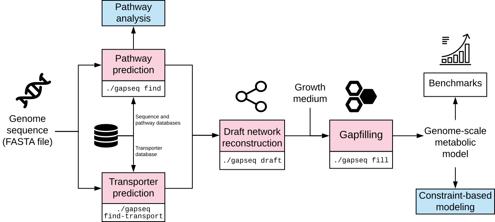

## gapseq

*Informed prediction and analysis of bacterial metabolic pathways and genome-scale networks*

### Purpose

gapseq is designed to combine metabolic pathway analysis with metabolic network reconstruction and curation. Based on genomic information and databases for pathways and reactions, gapseq can be used for:

- prediction of metabolic pathways from various databases
- transporter inference
- metabolic model construction (*genome-scale metabolic networks*)
- multi-step gap filling

### Links

[Documentation](https://gapseq.readthedocs.io/en/latest/?badge=latest)

[GitHub](https://github.com/jotech/gapseq)

[Publication](https://doi.org/10.1186/s13059-021-02295-1)

### Citing gapseq

> Zimmermann J, Kaleta C, <u>Waschina S</u>. [**gapseq: informed prediction of bacterial metabolic pathways and reconstruction of accurate metabolic models**](http://dx.doi.org/10.1186/s13059-021-02295-1) *Genome Biology*. 2021. 22(1). doi: 10.1186/s13059-021-02295-1

  
## Eutropia

*Agent-based metabolic modelling of microbial communities in time and continuous µ-meter-scale space*

### Purpose

Eutropia is a R-package for cell agent-based metabolic modelling of microbial communities. It allows dynamic simulations of two-dimensional surface-attached cell communities. A few features of Eutropia, that you might find interesting:

- Complex polygons (also non-convex) as growth environment
- Extracellular enzymes
- Nutrient regimes
- Chemotaxis (attracting and repelling)
- Direct calculations of community assortment and segregation (see e.g. [Yanni et al. (2015) Current Biology](https://doi.org/10.1016/j.cub.2019.03.068))

### Links

[Documentation](https://waschina.github.io/Eutropia/index.html)

[GitHub](https://github.com/Waschina/Eutropia)

